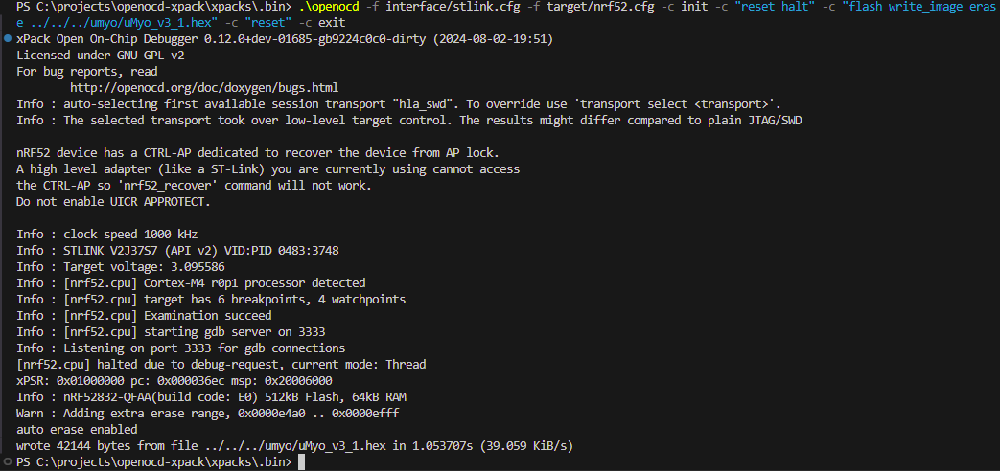

We’ll use openocd command in Powershell and a STLink v2 clone programmer.

1. Install openocd via xpack (easier) or use the one you already have (optional: install nodejs, npm and xpm, the instructions and pointers as to how install all prerequisites can be found here: https://xpack.github.io/xpm/install/)
2. Install openocd via xpack: https://xpack-dev-tools.github.io/openocd-xpack/docs/install/
3. Download uMyo firmware binary on some folder on your computer: uMyo_v3_1.hex
4. Connect swdio, swclk, gnd and 3v3 pins on the stlink to pogo pins in correct order (look at uMyo PCB)
5. Connect STLink v2 programmer to USB port
6. Install STlink drivers:
- download from here https://www.st.com/en/development-tools/stsw-link009.html#get-software and unpack them 
- install drivers for STLink in Device Manager (This PC - right button click - Manage - Device Manager), it should not have drivers yet, right click on STLink in Device Manager - Update Drivers - Browse My Computer for Drivers - stlink drivers folder
7. In Windows Powershell, go to the folder where you installed openocd-xpack and then to .bin where the command is: Path_to_openocd-xpack_Folder\xpacks\.bin> 
8. Press STLink pogo pins to uMyo firmly and hold
9. Run the openocd command to upload firmware:  .\openocd -f interface/stlink.cfg -f target/nrf52.cfg -c init -c "reset halt" -c "flash write_image erase Path_to_uMyo_hex/uMyo_v3_1.hex" -c "reset" -c exit
10. The terminal should show successful upload which looks something like this:

