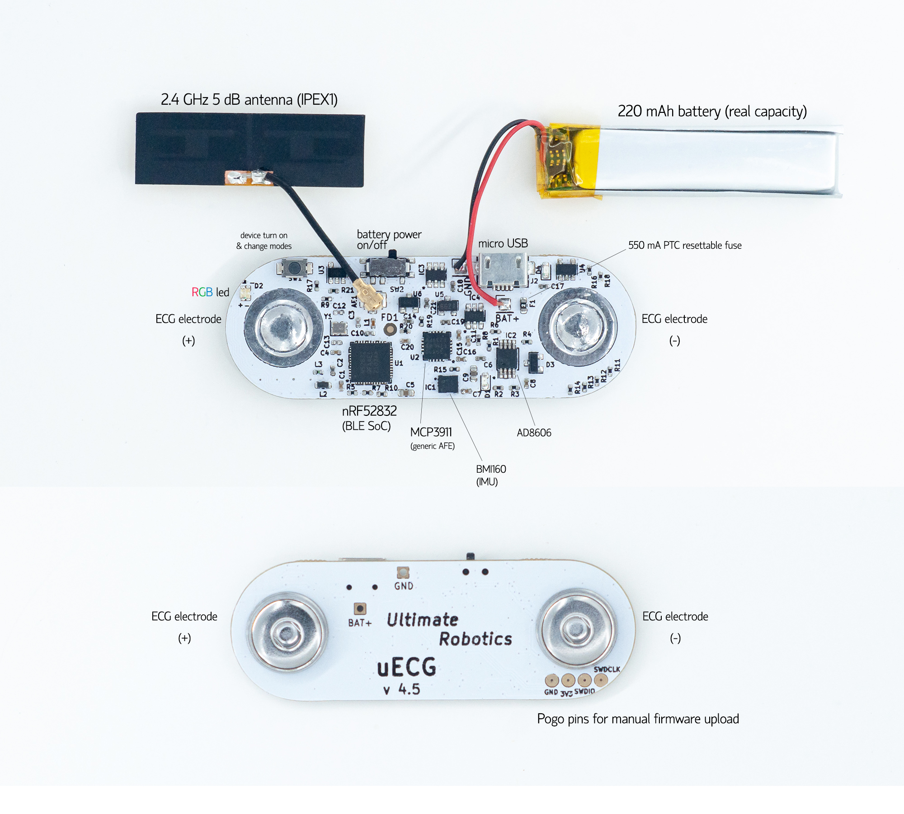

## What's in the box?

## Standard kit contains:

- uECG device in 3D-printed case;
- 10x disposable gel electrodes (45 mm);
- micro USB-B power cable;
- 3x replacement screws (1.6*6 mm);

## Optional (can be ordered with uECG):

- USB receiver base;
- STLink V2 USB programmer (with pogo pin adapter);
- extra gel electrodes (up to 20x);

## Power on/off

1. Move switch to ‘on’ position (towards USB). 
2. Press button once to turn uECG on. 
You should see several LED blinks: 
blue - red - green - blue.
This means device is on and ready to use.
3. Pink LED will flash when device is placed on skin. 
4. To turn uECG off, hold button for 3+ seconds, then release. 
If uECG will not be used for some time, move switch back
to ‘off’ position (towards button).

## Using uECG

1. After uECG is turned on, attach electrodes 
to snap connectors on uECG. 
2. Remove protective layer from them and place uECG 
on chest, slightly to the left of center, or in lower left.
3. Gently press uECG on skin to make sure it sticks.
4. After use, detach uECG and peel off electrodes. 
*electrodes can be left on the body for as long as you’re
comfortable, but can’t really be reused after removal 
(they won’t stick well), so you need to replace them 
for each session.

## Mobile App setup

1. Download uECG Monitor app from Google Play Store. 
You will need an Android phone with Android 6 to Android 10.
There is no iPhone version.
2. After downloading app, turn on Bluetooth on your phone, 
then turn on uECG. 
3. Hold uECG close to the phone and wait ~10-30 seconds to 
connect. When connected, the signal will appear in the app.
4. If it doesn’t connect, check that your location is on
(Bluetooth needs it)

## Mobile App Data

1. App shows RR variation, BPM, SDNN, and counts steps. 
To see separate charts for each, press ‘HRV plot’ in the app.
2. Data from app is stored on your phone. On Android versions
up to Android 9, go to [phone storage]/documents/uECG
3. For Android 10 phones, go to [phone storage]/android/data
/com.ultimaterobotics.uecgmonitor.4_2/files/documents
/uECG
4. For troubleshooting, hit the QR code below! 

## More info?

- [Main uECG page](/guides/uecg) - to learn more about uECG;
- [Getting started with uECG](/guides/uecg-getting-started-hackaday) - the full version