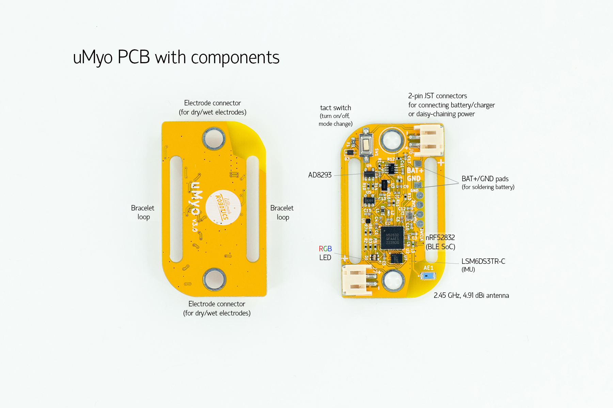

## What’s in the box?

## Standard kit contains:

- uMyo PCB
- LiPo charger PCB
- CR2032 battery holder PCB
- dry/wet electrodes/connectors (2 pcs of both per 1 uMyo)
- bracelet (color and size chosen while ordering)
- 10 disposable gel electrodes (22*22 mm)
- USB-Type C cable (for charging)
- 2 JST cables for connecting several devices

## uMyo only kit contains:

- uMyo PCB
- CR2032 battery holder PCB
- dry/wet electrodes/connectors (2 pcs of both per 1 uMyo)
- USB-Type C cable (for charging)
- 2 JST cables for connecting several devices

## Power on/off

1. Attach electrode connectors, dry or wet. For wet ones, you can
try not to solder them but firmly attach and see if they work 
like this. This way, you can use them both. 
2. Connect a battery to uMyo. You can use one with JST 
connector (see Hackaday for some links to buy if you need one).
Or solder any battery to the GND and V+ pads on the PCB.
You only need one battery for all connected uMyos. 
It’s best not to connect battery before attaching electrodes.
3. Press button on uMyo to turn it on. You should see several 
LED blinks: red-red-green, blue, then 3 blinks to show mode:
- pink - nRF24 mode
- blue - BLE mode
- green - PC station mode
4. Press button on uMyo for more than 2 seconds to turn it off. 
When LED will become red, you can release the button.

## Using uMyo with bracelet and dry connectors

1. Fasten dry connectors (screws and flat head bolts) 
to uMyo PCB’s electrode connectors, flat head on bottom.
You can use screwdriver or just insert and press the screw 
to the top of PCB while fastening the bottom part. 
2. Pass one end of bracelet through the loop in the PCB 
and fix it with Velcro. The soft part of the Velcro should be
up. Pass the other end of the bracelet through the second loop.
3. Place the bracelet on your arm and find the required active 
muscle by moving your fingers or squeezing your hand.
4. After finding the required active muscle, position uMyo 
over it and tighten the bracelet so bolts are in tight contact 
with skin. Close the bracelet with Velcro.
5. Check if the current position is optimal by contracting 
the active muscle several times. The muscle activity LED 
should glow: this shows that uMyo is reacting to your actions.

## Using uMyo with disposable gel electrodes

1. Solder or just attach firmly the connector buttons to uMyo 
PCB’s electrode connectors. See Hackaday for a video guide.
2. Snap two disposable gel electrodes to the buttons.
3. Find the required active muscle by alternately 
moving your fingers or squeezing your hand. 
4. After finding the required active muscle, attach uMyo 
with the electrodes to it. 
5. Check if the current position is optimal by contracting 
the active muscle several times. The muscle activity LED 
should glow: this shows that uMyo is reacting to your actions.

## Using uMyo with Arduino

uMyo supports two ways of connecting it to Arduino:
- nRF24 module with any Arduino model; 
- BLE connection to ESP32 Arduino boards. 

For ESP32, you will need uMyo_BLE library from Arduino library 
manager. For other Arduino types + nRF24 module, you’ll need
uMyo_RF24 library. 
Each library version has several examples showing how to 
get muscle data, orientation data (roll, pitch, yaw angles), 
and how to get data from several devices.

## More info?

- [Main uMyo page](/guides/umyo) - to learn more about uMyo;
- [Getting started with uMyo](/guides/umyo-getting-started-hackaday) - the full version;
- [Demo projects](/guides/umyo-demo-projects) using 1 or 2 uMyos