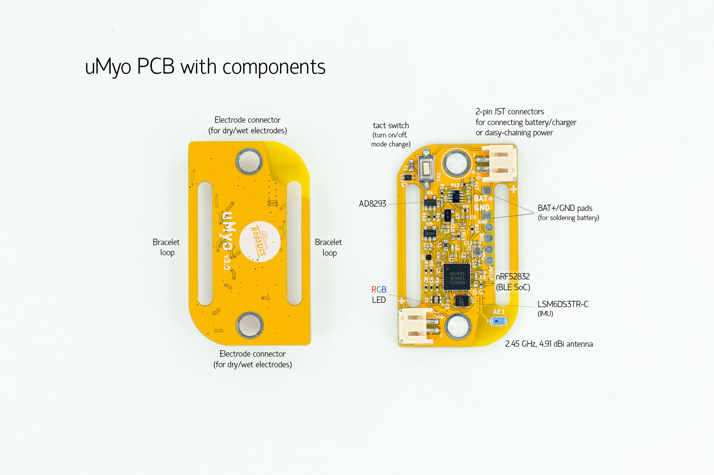

uMyo is a single channel wearable EMG sensor with wireless data transmission. Multiple sensors can be connected to one receiver. It is certified open source hardware (https://certification.oshwa.org/ua000003.html)

What can you do with uMyo?

uMyo is a flexible EMG system allowing to pick up signals from different muscles - and not only from arms, but also legs, torso or even face.

## Main features of uMyo are:
- It's wireless! No more mess of wires when working with EMG
- Works with any Arduino via nRF24 radio module (you can use our Arduino library)
- Works with ESP32 with no extra hardware (we also wrote an Arduino library)
- Multiple units (up to 12 in current version) can send data to the same Arduino/ESP32
- Sends out detected muscle activity level, 4-bins spectrum; and raw EMG data (in nRF24 mode)
- Can be used with a bracelet and dry electrodes, or with gel electrodes via soldered connector

uMyo is a fairly versatile device, so we designed it so that some users do not spend money on additional components or can purchase them in any online store (or local) if necessary.

What components are we talking about?

1. Battery. You can solder any lipo battery to uMyo, but you can also plug in any battery with a 2-pin 2mm JST-PH connector. Links to some suitable batteries are below:

2. Arduino: uMyo can be used with any Arduino via nRF24 radio module.

3. ESP32: uMyo can be used directly with ESP32 BLE radio, with no additional hardware required

If you still have questions, feel free to email us hi@ultimaterobotics.com.uahat

## What’s in the box?

## Standard kit contains:

- uMyo PCB
- LiPo charger PCB
- CR2032 battery holder PCB
- dry/wet electrodes/connectors (2 pcs of both per 1 uMyo)
- bracelet (color and size chosen while ordering)
- 10 disposable gel electrodes (22*22 mm)
- USB-Type C cable (for charging)
- 2 JST cables for connecting several devices

## uMyo only kit contains:

- uMyo EMG sensor
- dry metal electrodes (4 pcs)
- USB-Type C cable (for charging)
- 2 JST cables for connecting several devices

## More info?

- [Main uMyo page](/guides/umyo) - to learn more about uMyo;
- [Getting started with uMyo](/guides/umyo-getting-started-hackaday) - the full version;
- [Demo projects](/guides/umyo-demo-projects) using 1 or 2 uMyos