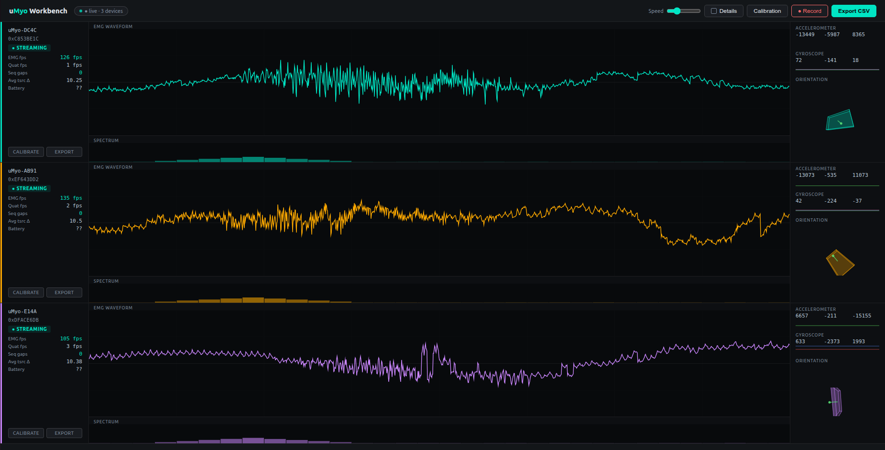
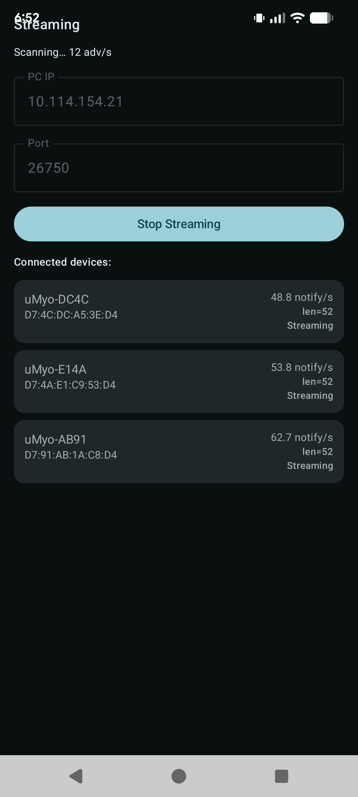

import { Aside } from '@astrojs/starlight/components';

<Aside type="tip">
**Last updated March 19, 2026.** Multi-device BLE streaming is now confirmed working — three uMyos streaming simultaneously. The workbench is now browser-based. See [What changed on March 19](#what-changed-on-march-19) for a quick summary.
</Aside>

## Overview

In March 2026 we released significant firmware and software updates for uMyo, including BLE connectivity via Android bridge, OTA firmware updates, multi-device simultaneous streaming, and a new web workbench. This page covers what's new, how to get it, and what's coming next.

If you received a device in the March 2026 batch, there's a section below explaining which firmware your specific device shipped with.

---

## What changed on March 19

Since the initial March release, the following has landed:

- **Multi-device BLE confirmed working** — three uMyos streaming EMG + IMU + magnetometer simultaneously via a single Android phone
- **New web workbench** — replaces the pygame GUI with a browser-based interface (dark instrument theme, per-device waveform, spectrum, 3D orientation cube, sparklines)
- **Persistent device naming** — device names survive firmware updates and reconnects
- **BLE scanner filtering** — the Android app now ignores non-uMyo BLE devices, which fixes connection slot exhaustion in crowded RF environments

Known issues still being worked on: IMU fps drops under heavy EMG load (firmware fix in progress), IMU dropout under heavy RF congestion (same root cause, BLE scheduler — firmware fix next).

---

## New capabilities

### Multi-device BLE streaming

Three uMyos can now stream EMG, IMU, and magnetometer data simultaneously via a single Android phone. No USB base required.

Each device gets its own row in the workbench with independent waveform, spectrum, orientation, and metrics.

### BLE connectivity via Android bridge

uMyo streams data over Bluetooth LE to an Android phone, which forwards it to your PC over WiFi. This gives you real-time EMG, IMU, and magnetometer data in the workbench without a USB receiver base.

### OTA firmware updates

Devices shipped with the updated bootloader can receive firmware updates wirelessly via the Android app. No programmer or USB connection required.

### New web workbench

A browser-based workbench replaces the previous pygame GUI. It runs a local Python WebSocket server (`uf1_workbench_server.py`) and opens automatically in your browser. Features per device:

- Real-time EMG waveform (auto-scaled, 2.5s buffer)
- Frequency spectrum
- 3D orientation cube (real quaternion from firmware)
- ACC/GYRO sparklines
- Metrics: EMG fps, QUAT fps, seq gaps, tsrc Δ, battery
- Calibration overlay



### Persistent device naming

Device names now persist across firmware updates and reconnects. The Android app re-sends the device name every 5 seconds after first data, so names survive brief disconnects. The name cache is MAC-keyed.

---

## Which firmware does my device have?

Check the shipping notification email — the date and carrier tell you which firmware your device has.

**fw-base** — shipped via DHL on or around March 10

- Stable firmware with new magnetometer support and memory improvements
- Works with nRF24 and USB base station modes
- No BLE transport, no OTA capability
- To update: requires SWD programmer — contact us via [Discord](https://discord.com/invite/dEmCPBzv9G) or email and we'll help

**fw-ble** — shipped via DHL on or around March 13

- BLE transport: raw EMG + full workbench mode via Android bridge
- Original bootloader — no OTA capability yet
- Can be upgraded to OTA capability with a one-time SWD flash of the new bootloader — after that, all future updates are wireless

**fw-ble-ota** — shipped via Ukrposhta on or around March 13–14

- BLE transport + OTA-capable bootloader
- Firmware updates wirelessly via Android app
- Most capable configuration

Not sure which firmware you have, or need help upgrading? Join our [Discord](https://discord.com/invite/dEmCPBzv9G) or email us.

---

## Platform support

| Platform | Status |
|---|---|
| Android (BLE bridge + OTA) | ✅ Working |
| USB receiver base | ✅ Working |
| Arduino / ESP32 (nRF24 or BLE) | ✅ Working |
| Raspberry Pi | 🔄 Planned next |
| Windows / Linux / Mac direct BLE | 🔄 Planned |
| iPhone / iOS | 🔄 Planned |

---

## Getting started with the Android bridge

### Requirements

- Android phone (Android 11+: Location permission and Location toggle must be ON for BLE scan)
- PC and phone on the same WiFi network
- uMyo with fw-ble or fw-ble-ota firmware

### Steps

1. Find your PC's local IP address (`ip addr` on Linux, `ipconfig` on Windows)
2. Download the APK from the [v0.1.0 release](https://github.com/ultimaterobotics/umyo-android/releases/tag/v0.1.0) and install it. Enable "Install from unknown sources" in developer options if prompted.
3. Open the app, enter your PC's IP address and port (default: `26750`)
4. Press the button on uMyo to power on, then press repeatedly to cycle modes until the LED is solid blue (BLE mode)
5. Tap **Start GATT Raw** in the app — device connects automatically
6. On your PC, clone [uf1-tools](https://github.com/ultimaterobotics/uf1-tools) and run the workbench:

```bash
cd uf1-tools
python -m venv venv
source venv/bin/activate      # on Windows: venv\Scripts\activate
pip install -e ".[dev]"
pip install websockets
export PYTHONPATH=src         # on Windows: set PYTHONPATH=src
python tools/uf1_workbench_server.py
```

The workbench opens automatically in your browser. Your device appears as a row and starts streaming.

<Aside>
If the workbench doesn't receive data, you may need to allow port 26750 in your firewall. On Linux with ufw: `sudo ufw allow 26750`. Ask in [Discord](https://discord.com/invite/dEmCPBzv9G) if you get stuck.
</Aside>

### Connecting multiple devices

With the workbench running, tap **Start GATT Raw** for each additional uMyo. Each device appears as its own row automatically. Up to three confirmed working simultaneously; more may work depending on your phone's BLE stack.



---

## How to update firmware via OTA

<Aside type="caution">
Requires fw-ble-ota (OTA-capable bootloader). If you have fw-base or fw-ble, contact us — we can walk you through a one-time wired upgrade that gives you OTA capability from then on.
</Aside>

1. Enable Bluetooth and Location on your phone, open the app
2. Enter your PC IP and port if not already set
3. Long-press the uMyo button for ~5 seconds until LED blinks blue slowly — device is now in bootloader mode
4. Press the button once briefly — switches bootloader from base to BLE mode (no LED change, expected)
5. Tap **Start OTA (asset)** in the app
6. Upload takes approximately 4–5 minutes. Do not close the app or turn off uMyo during upload.

---

## What's coming next

- Firmware fix: IMU fps stability under heavy EMG load (BLE scheduler rate-limiting)
- Rename UI in Android app
- Export CSV from workbench
- Raspberry Pi support
- In-app firmware file picker for OTA
- Viewer mode in Android app
- Direct BLE support on Windows / Linux / Mac
- iOS support
- F-Droid release, then Play Store

---

## Questions?

Join our [Discord](https://discord.com/invite/dEmCPBzv9G) — we're active there and most questions get answered the same day.
